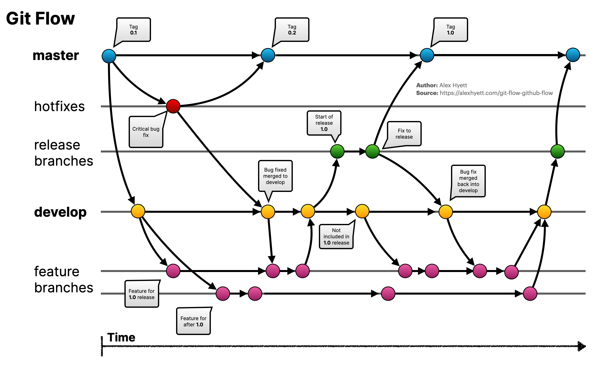

# Git & Github

## Version Control

* VCS
* Keep track of the changes made to our files
* Commit
  * A collection of edits to multiple files as a single change
* Repository
* Git is a distributed VCS

## Git

* Three sections: the Git directory, the working tree, and the staging area
* Two file types: tracked or untracked
* Three file states: modified, staged, committed

### Workflow

* Initialising an empty git repositiry
* Track or stage files
* Commit the changes
* `git config --global user.email "example@my.com"`
* `git config --global user.name "MyName"`
  * Set the email and name of the commit author
* `git config -l`
  * Checking configs
* `git init`
  * Initialise an empty git repository `/.git` in the current directory
* `git status`
* `git add`
* `git rm`
* `git mv`
  * Rename files
* `git commit`
  * Save the current state of changes in the local repository, creating a snapshot of the code at that point in time

* `git commit -a`
  * A shortcut to stage any changes to **tracked files** and commit them in one step
* `git log`
  * View the history of your changes
  * `--graph --oneline`
* `git diff`
* `.gitignore`

### Undoing things

* `HEAD` is a pointer to the current commit
* `git checkout file`
  * Undo unstaged changes before commit
* `git reset HEAD file`
  * Unstage the staged files
* `git commit --amend`
  * Overwrite the previous commit message
  * ==Avoid amending commits that have already been made public==
* `git revert commitID`
  * Not undo, instead create a new commit that rewind the old commit

### Branching and Merging

* Branch is a pointer to a perticular commit
* Default branch `master`
* `git branch`
  * Check all branches
* `git branch new-branch-name`
  * Create a new branch on your local machine
* `git checkout branch-name`
  * Switch to another branch
* `git checkout -b new-branch-name`
  * Shortcut fro creating and switching to a new branch
* `git branch -d branch-name`
  * Delete a branch
* `git merge branch-name`
  * Merge a branch
* Fast-forward merge
  * Just update the pointer
  * A merge when all the commits in the checked out branch are also in the branch that's being merged
* 3-way merge
  * Merge the snapshots at two branch tips with the most recent common ancestor
* Merge conflict
  * Changes are made on the same part of the same file
  * Git prevents loss of work if two lines overlap
  * `git merge --abort`
    * Can only be used after merge conflict
    * Abort the merge and try to go back to the pre-merge state

### Working with Remotes

* Remote is a branch
* `git clone`
* `git push`
* `git push -u origin <branchname>`
  * Create a new remote branch and push local changes to the remote server

* `git push --delete origin <branchname>`
  * Delete a remote branch

* `git pull`
  * Fetch from and integrate with another people's changes from that branch
* `git fetch`
  * Download objects and refs from another repository
* Pull-merge-push workflow

## Git Flow vs. Github Flow

* 
* 
* [Link](https://www.alexhyett.com/git-flow-github-flow/)
